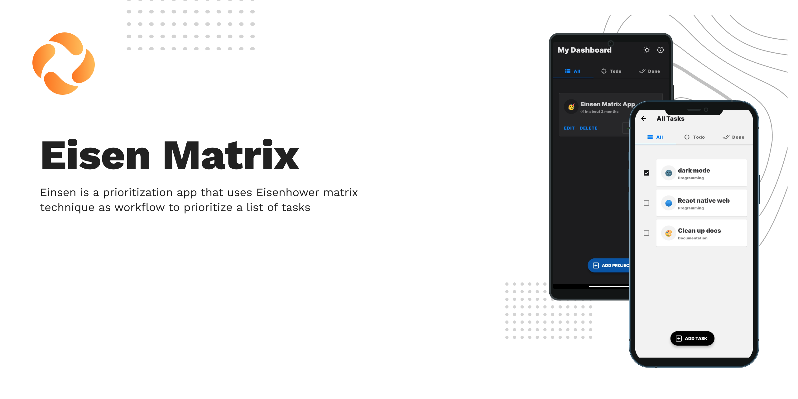

[](LICENSE)


# 🎯 Eisen Matrix

 Eisen Matrix is a prioritization app that uses Eisenhower matrix technique as workflow to prioritize a list of tasks & built with React Native for learning purposes inspired by [Einsen](https://github.com/Spikeysanju/Einsen) which is written in **Kotlin**.<br />


<br />

## 🏃 Running Locally

```bash
$ git clone https://github.com/G3root/Eisen-Matrix.git
$ cd Eisen-Matrix
$ yarn install
$ yarn start
```

<br />

## 🌞 Light Mode

|   Dashboard    | Matrix Table    |   All Tasks   
|---	|---	|---
|  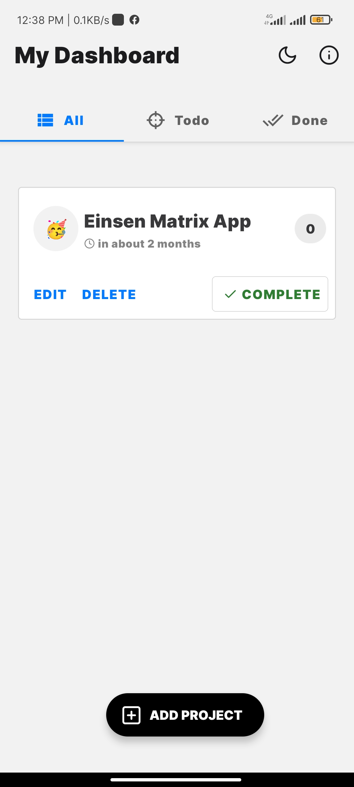    |  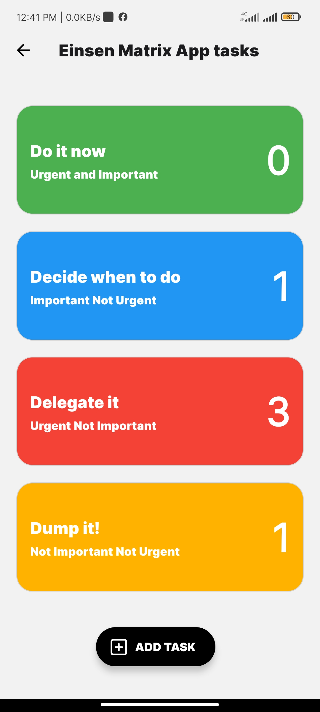    |   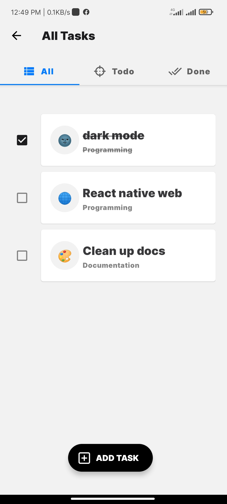    

|   Task Details  |   Add Task    | Empty State    |
|---    |---	|---	|
|   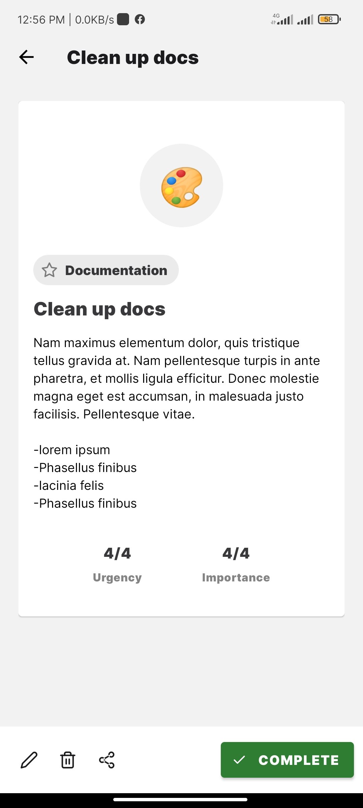    |   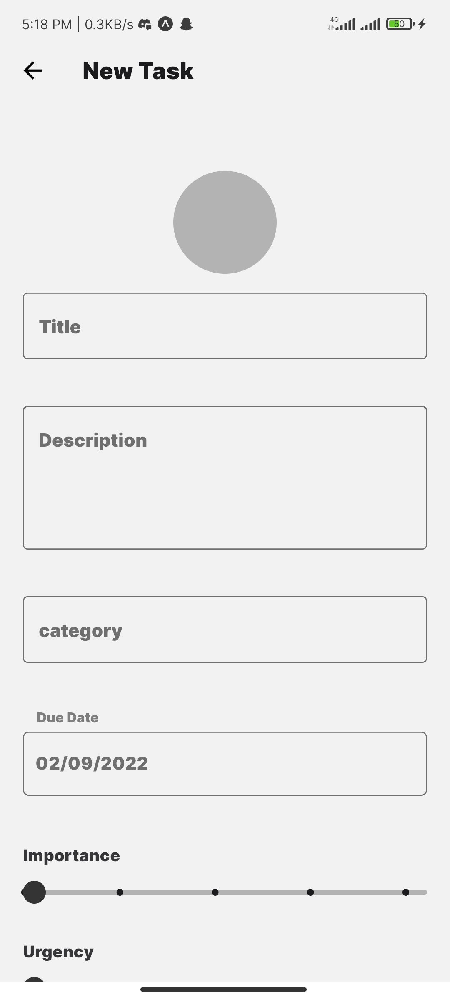      |   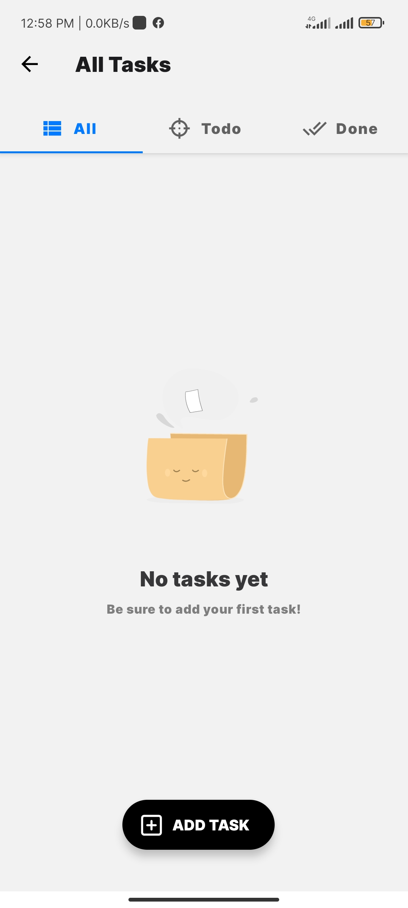

<br />

## 🌚 Dark Mode

|   Dashboard    | Matrix Table    |   All Tasks   
|---	|---	|---
|  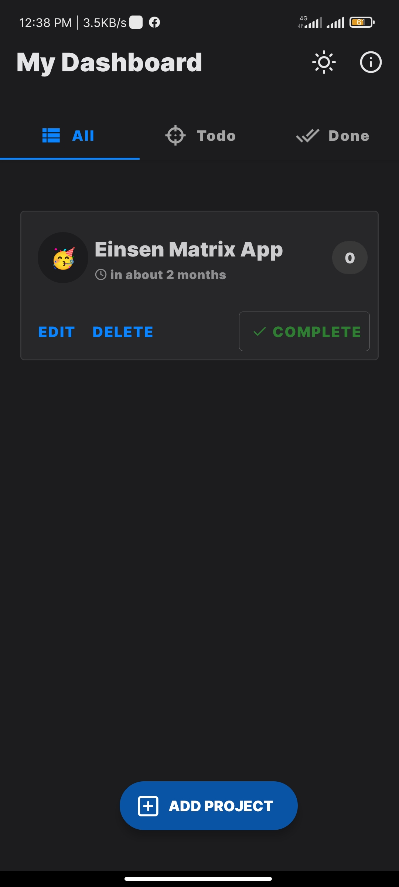    |  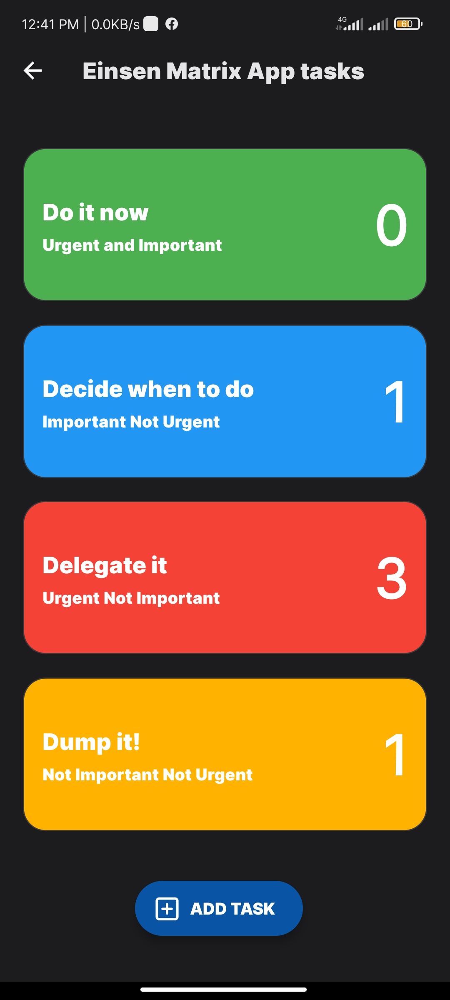    |   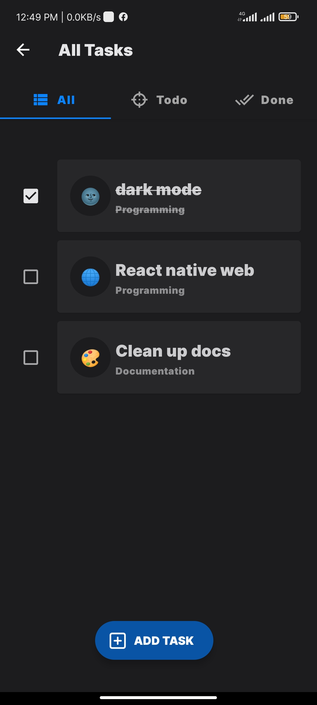    

|   Task Details  |   Add Task    | Empty State    |
|---    |---	|---	|
|   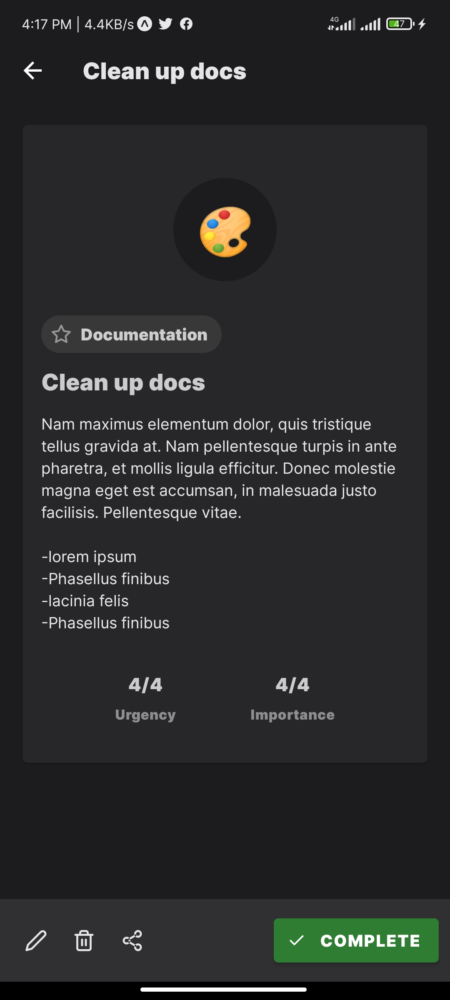    |   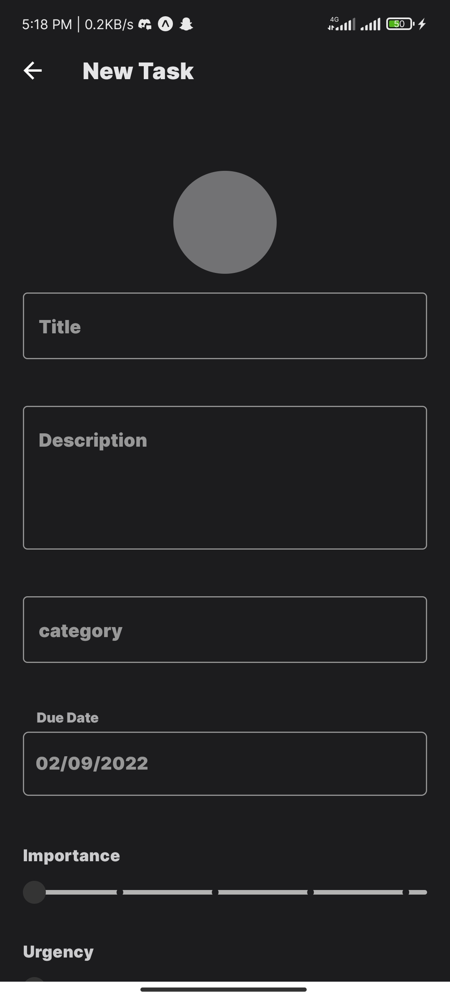      |   

<br />

## 🛠 Built With

- [Expo](https://expo.dev/) - Supercharged React Native workflow.
- [Zustand](https://github.com/pmndrs/zustand) - A small, fast and scalable bearbones state-management solution using simplified flux principles.
- [Emotion](https://emotion.sh/) - a performant and flexible CSS-in-JS library.
- [React Native Paper](https://callstack.github.io/react-native-paper/) - Cross-platform Material Design components for React Native.
- [React Hook Form](https://react-hook-form.com/) - Performant, flexible and extensible forms with easy-to-use validation.
- [Immer](https://immerjs.github.io/immer/) - simplified handling immutable data structures.
- [React Navigation](https://reactnavigation.org/) - Routing and navigation for Expo and React Native apps.
- [TypeScript](https://www.typescriptlang.org/) - JavaScript with syntax for types.

<br />

## 📩 Contact

I know that first and foremost you are looking for a tool to solve your problems, but if you enjoy
it that much, why not tell us? We would love to hear from you 😉

DM me at 👇

* Twitter: <a href="https://twitter.com/nfs__21" target="_blank">@nfs__21</a>
* Email: nafeesnazik21@gmail.com

<br>

## 🤗 Credits

- App Icons from [Logos-by-larkef](https://rareblocks.xyz/logos-by-larkef)
- Project inspiration [Einsen](https://github.com/Spikeysanju/Einsen)

<br>

